# Лаба 1. Пишем свой докер

Задание: https://github.com/KeladKaal/containerization-and-orchestration/blob/main-rus/lecture-1-docker/lab.md

## Часть 0. Тестовая апишка

По ТЗ нужна мелкая HTTP-апишка, на которой потом гонять namespaces и cgroups. Написание сервиса не оценивают, поэтому накидал FastAPI на питоне.

Код: [`../../api`](../../api)

```
GET /health   → ok
GET /eat?mb=N → выделяет N МБ и держит до конца жизни процесса
GET /burn     → busy-loop на одном ядре
```

`/eat` кладёт `bytearray` в глобальный список `_held`, чтобы GC не забрал память.  
`/burn` крутит `while True: _ = 1000**1000` в отдельном потоке, чтобы HTTP не умер.

## Часть 1. Запуск напрямую

Без контейнеров, просто uvicorn на маке:

```bash
cd api && .venv/bin/uvicorn main:app --host 127.0.0.1 --port 8080
```

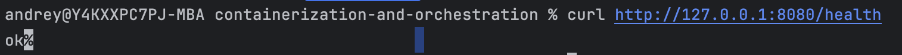

`/health` отдал `ok`. В `ps` процесс обычный, PID **9882**, изоляции ноль — точка отсчёта.

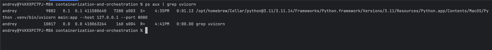

После `/eat?mb=500` VSZ вырос примерно на 500 МБ (`411580640 → 412092672`). RSS почти не дернулся: на маке страницы не трогали, в физическую память они не сели. Для OOM потом в буфер надо писать.

Потом `/burn` — кулер на Ryzen 5 7520U завыл.

```bash
  PID  %CPU %MEM    RSS      VSZ COMMAND
 8110  22.7  0.2  13104 412228912 /opt/homebrew/Cellar/python@3.11/3.11.14/Frameworks/Python.framework/Versions/3.11/Resources/Python.app/Contents/MacOS/Python .venv/bin/uvicorn main:app --host 127.0.0.1 --port 8080
```

## Часть 2. namespaces

На маке `unshare` нет, всё делал в Lima (`limactl shell lab`).

Ubuntu по дефолту душит unprivileged user ns, поэтому один раз:

```bash
sudo sysctl -w kernel.apparmor_restrict_unprivileged_userns=0
```

Дальше **без sudo**:

```bash
unshare --pid --mount --net --uts --ipc --user --map-root-user --fork bash
```

`--fork` нужен, чтобы стать PID 1. `--map-root-user` — root внутри, `andrey` снаружи.

Сразу после входа `/proc` ещё хостовый, `ps` врёт. Вешаю свой:

```bash
mount -t proc proc /proc
```

Изнутри: `echo $$` → **1**, в `ps` только bash и сам ps.

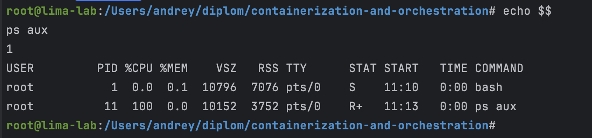

`hostname lab-box` переименовал только меня (uts).  
`ip link` — один `lo` в DOWN, сети нет (net).  
`id` внутри — uid 0.

С хоста тот же bash:

```
456580 andrey  501  bash
```

Внутри root и PID 1, снаружи обычный пользователь. Это user ns.

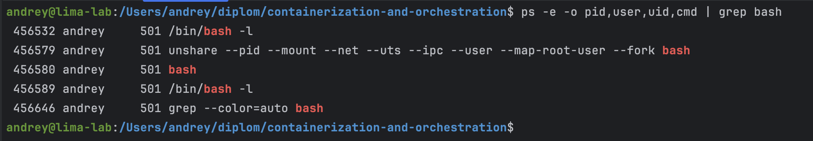

Что закрыл каждый namespace:

- **pid** — своя нумерация, я единица
- **mount** — свой `/proc` (без него pid ns не доказать)
- **uts** — своё имя хоста
- **net** — пустой стек
- **user** — root внутри ≠ root снаружи
- **ipc** — своя песочница для sysv-очередей

Namespaces прячут обзор. Жор ресурсов они не ограничивают.

## Часть 3. cgroups

Завёл группу `/sys/fs/cgroup/lab1` и повесил потолки:

| крутилка | значение | смысл |
|----------|----------|--------|
| memory.max | 100M | потолок RAM |
| memory.swap.max | 0 | без свопа, иначе OOM не поймаешь |
| cpu.max | 50000 100000 | пол-ядра |
| pids.max | 10 | не больше 10 процессов |

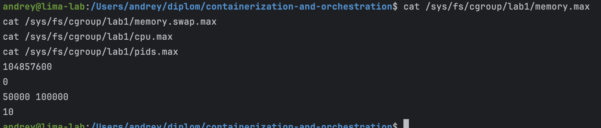

Важно: сначала шелл в cgroup, потом уже uvicorn. Иначе сервис уедет мимо лимитов.

**Память.** `/eat?mb=150` поверх ~35 МБ базы — процесс убит. В `dmesg`: `CONSTRAINT_MEMCG`, `oom_memcg=/lab1`. Это тот же OOMKilled, что в Kubernetes: убита группа, не вся машина.

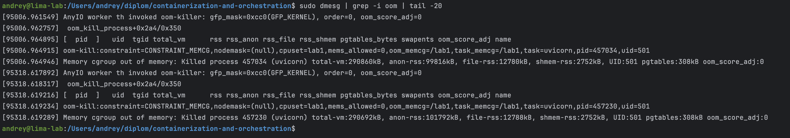

**CPU.** После `/burn` в `cpu.stat` выросли `nr_throttled` и `throttled_usec`. По дельте ~48% CPU при квоте 50%. Процесс живой, его просто душат.

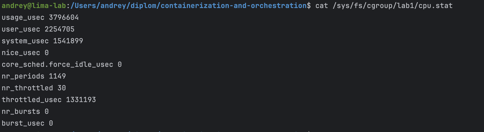
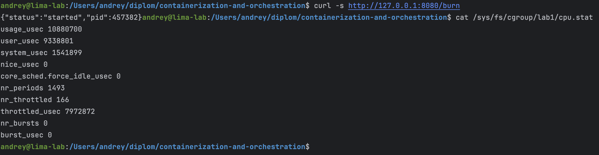

**Процессы.** `stress-ng --fork 100` упёрся в `pids.current = 10`, а `pids.events max` набежал в тысячи — это отбитые fork, не живые процессы.

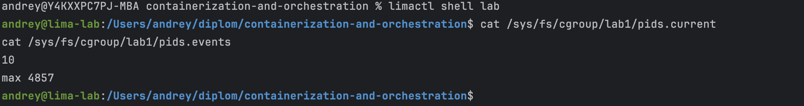

## Часть 4. Права

**Capabilities.** Root — не один рубильник, а пачка прав. Срезал всё через `setpriv`:

```bash
sudo setpriv --reuid=501 --regid=1000 --clear-groups \
  --bounding-set=-all --inh-caps=-all --ambient-caps=-all -- sleep 120
```

В `/proc/.../status` все `Cap*` стали нулями.

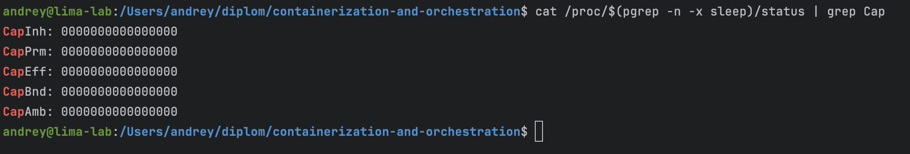

**seccomp.** Написал маленький лаунчер [`seccomp-run.c`](./seccomp-run.c): всё разрешает, `getppid` отвечает `EPERM`.

Без фильтра `os.getppid()` печатает нормальный PID. С лаунчером — `-1`: ядро вызов не делает, питон печатает сырую ошибку.

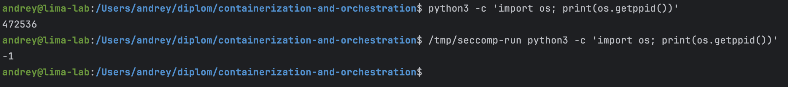

В статусе процесса: `NoNewPrivs: 1`, `Seccomp: 2`, один фильтр.

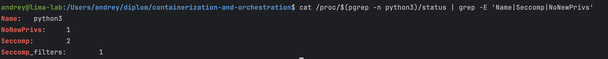

Capabilities режут «что можно root-у». seccomp режет «какие двери в ядро открыты».

## Часть 5. Свой Docker

Всё из частей 2–4 собрал в [`mydocker.sh`](./mydocker.sh): cgroup → unshare → veth → setpriv → seccomp → uvicorn.

```bash
bash lecture-1-docker/lab-work/mydocker.sh
```

Внутри uvicorn стал PID 1, с хоста:

```
curl http://10.200.1.2:8080/health  → ok
```

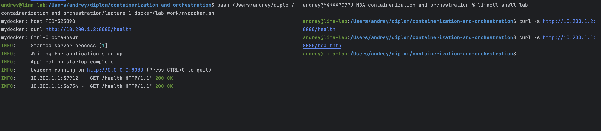

Тот же сервис через настоящий Docker:

```bash
docker run --rm -p 8080:8080 --cpus=0.5 ... python:3.11-slim ...
curl http://127.0.0.1:8080/health  → ok
```

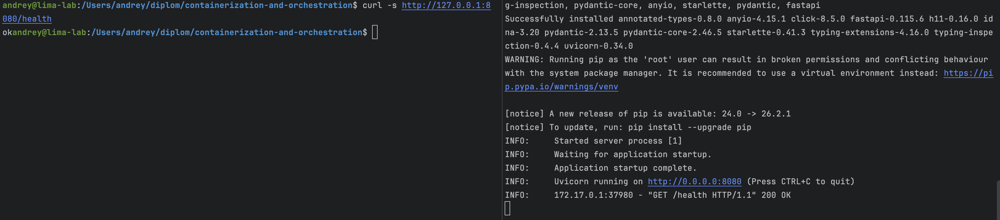

**Что совпадает:** процесс на общем ядре, namespaces (PID 1, своя сеть), cgroups, урезанные права, сеть через veth/bridge.

**Чего в скрипте нет:** образ и overlayfs, registry, dockerd/containerd/runc/shim, удобный `-p`, volumes, DNS, нормальный seccomp-профиль по умолчанию.

**Что Docker делает сверху:** собирает rootfs из слоёв, сам клеит сеть и iptables, хранит логи и метаданные, контейнер живёт под shim отдельно от твоего терминала.

По сути `mydocker.sh` — узкий разрез того, что делает `runc`. Docker — те же механизмы плюс образы и демоны.

## Часть 6. Образы

Скрипту не хватало готовой ФС — её даёт образ.

В `api/`:
- `Dockerfile` — простой
- `Dockerfile.multistage` — pip в builder, в финал только пакеты + код, ещё `USER nobody`

| образ | размер |
|-------|--------|
| api:simple | 262 МБ |
| api:multi | 246 МБ |

Multi чуть тоньше: в финал не тащится мусор сборки. Для Python это не `scratch` как у Go, но идея та же.

Повторный `docker build` почти весь из `CACHED` — пока не трогаешь `requirements.txt`, тяжёлый pip не пересобирается. Поэтому зависимости копируем раньше кода.

Без тома файл внутри контейнера после recreate пропал. С `-v lab1-data:/data` остался. Writable-слой эфемерный, данные живут в volume.

## Часть 7. gVisor

Поставил `runsc`, Docker его увидел:

```
Runtimes: runc runsc ...
```

В Lima с сетью sandbox сразу ругался (`cannot run with network enabled in root network namespace`) — связка старого runsc и виртуалки. На обычном Linux обычно хватает:

```bash
docker run --runtime=runsc --pids-limit=50 -p 8081:8080 api:multi
```

Отдельный грабель: `--pids-limit=20` может убить sandbox на старте — gVisor сам форкает служебные процессы. С 50 уже ок, `/health` отвечает как обычно.

Снаружи почти ничего не меняется. Внутри — да.

| | mydocker / обычный Docker | gVisor |
|--|---------------------------|--------|
| syscall | сразу в хостовое ядро | большая часть в Sentry (userspace) |
| зачем | повседневная изоляция | меньше поверхность атаки ядра |

**Что у обычного контейнера всегда общее с хостом — ядро.** Namespaces и cgroups не дают второго kernel. Уязвимость ядра потенциально бьёт по всем контейнерам на ноде. Это потолок контейнерной изоляции; дальше уже gVisor/Kata/VM.

## Часть 8. Мониторинг

Руками cgroup мы уже смотрели в части 3. Для дашборда поднял cAdvisor → Prometheus → Grafana.

Конфиг: [`monitoring/`](./monitoring/)

```bash
cd lecture-1-docker/lab-work/monitoring && docker compose up -d
docker run -d --name lab1-api --memory=64m --cpus=0.5 -p 8080:8080 api:multi
```

На дашборде три панели: память (working set vs limit), CPU (usage vs quota), throttling.

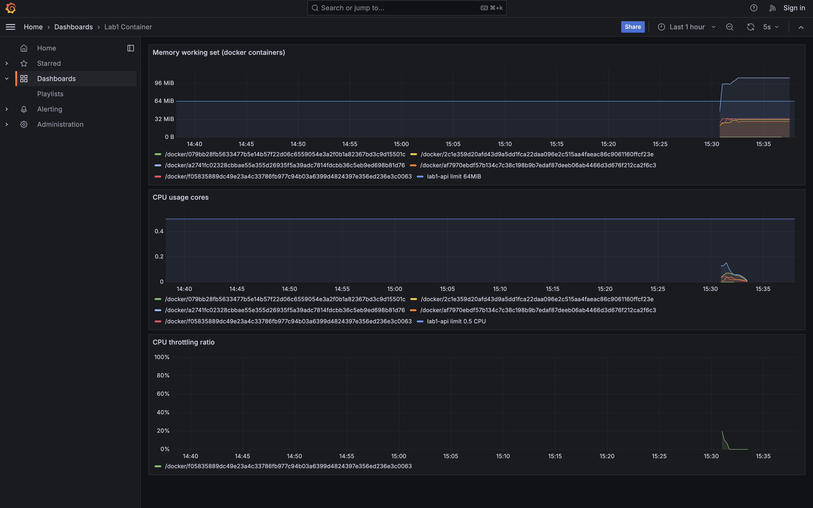

После `/eat` и `/burn` графики поехали вверх — те же эффекты, что OOM и throttling из части 3, только видно сразу.

**Три алерта:**

| алерт | что ловит | чем грозит |
|-------|-----------|------------|
| память > 80% лимита | близко к потолку | ещё чуть — OOMKilled |
| CPU > 85% квоты | постоянно упираемся в limit | растёт латентность |
| throttling > 15% периодов | ядро реально душит | «тихий» тормоз без явных ошибок |

---

Итого: контейнер = обычный процесс + namespaces (что видит) + cgroups (сколько можно) + права (что разрешено). Docker это упаковывает. gVisor добавляет прослойку, когда общему ядру уже не доверяешь. Мониторинг эти рычаги делает видимыми до падения в проде.
