# Лабораторная работа №2 - Наблюдаемость: метрики, логи, трейсы и алерты

В этой лабораторной я собирал систему наблюдаемости для HTTP-сервиса.

Для экспериментов я использовал Python-сервис на FastAPI и Minikube с Docker-драйвером. Приложение и компоненты наблюдаемости настроил через Helm-чарты и values-файлы. За метрики отвечают Prometheus и Grafana, за логи - Grafana Alloy и Loki, за трассировки - OpenTelemetry и Jaeger. Алерты вычисляет Prometheus, доставляет Alertmanager; результат я проверял в webhook-получателе и Karma. Связи компонентов показаны на схеме.

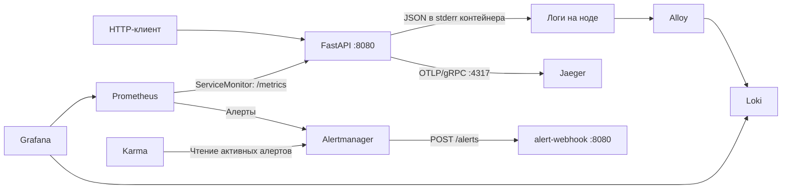

Весь стек запускал на одной ВМ. После добавления Loki она начала сильно тормозить — об этом подробнее в части 2.

## Часть 0. Подготовка HTTP-сервиса и инфраструктуры

### HTTP-сервис и инструментирование

Для проверки использовал сервис с намеренными сбоями. `/fail` всегда возвращает 500, а `/slow` задерживает ответ на 1–3 секунды. Не нужно ждать, пока что-нибудь сломается само. Код находится в [api/main.py](../../api/main.py), зависимости - в [requirements.txt](../../api/requirements.txt).

| Эндпоинт | Поведение по исходному коду |
|---|---|
| `GET /health` | HTTP 200 с текстом `ok`; используется также readiness- и liveness-пробами |
| `GET /fail` | HTTP 500 с JSON `{"error":"intentional failure"}`, error-лог `intentional_failure` и ошибочный статус текущего спана |
| `GET /slow` | Задержка от 1 до 3 секунд внутри спана `slow-op`; ответ содержит `status` и `slept_seconds` |
| `GET /load` | Асинхронные запросы к собственному `/health`; параметры `requests` (1–500, по умолчанию 50) и `concurrency` (1–100, по умолчанию 20); ответ содержит `requested`, `succeeded`, `failed` |
| `GET /metrics` | Метрики в формате Prometheus, включая счётчики и гистограмму HTTP-запросов |

### Кластер и Docker-образ

Стенд запускал на Linux в виртуальной машине. Установку kubectl и Minikube показал на [скриншоте](./screenshots/minikube.png), Helm - на [отдельном снимке](./screenshots/helm_install.png). Ниже итоговые параметры Minikube после настройки ресурсов ВМ.

```bash
minikube start --driver=docker --memory=8096mb --cpus=4 --disk-size=20g
```

[Dockerfile приложения](../../api/Dockerfile) использует `python:3.11-slim`, устанавливает зависимости и запускает Uvicorn на `0.0.0.0:8080` с отключённым стандартным access-log. Образ собрал непосредственно в Minikube из корня проекта.

```bash
minikube image build -t my-api:latest ./api
minikube image ls | grep my-api
```

В [values приложения](../../helm/api/values.yaml) задано `imagePullPolicy: Never`: Kubernetes должен использовать уже собранный образ на ноде, без загрузки из внешнего registry.

### Helm-чарт и доступ к приложению

В [Helm-чарте](../../helm/api) описаны Deployment, ClusterIP Service, ServiceMonitor и PrometheusRule. [Deployment](../../helm/api/templates/deployment.yaml) запускает одну реплику с requests `25m` CPU / `64Mi` памяти и limits `250m` / `256Mi`, передаёт `.Values.env` в контейнер и проверяет `/health`. [Service](../../helm/api/templates/service.yaml) выбирает поды по `app: api`, публикует порт 8080 и направляет его на именованный порт контейнера `http`.

Для приложения создал namespace `app`, для компонентов наблюдаемости - `observability`.

```bash
kubectl create namespace app
kubectl create namespace observability
```

```bash
helm upgrade --install api ./helm/api -n app --wait
```

Для доступа с локальной машины использовал port-forward к Service.

```bash
kubectl port-forward -n app svc/api 8080:8080
```

Локальный `127.0.0.1:8080` перенаправляется на Service `api:8080`, а затем на Uvicorn в контейнере. Service имеет тип ClusterIP, поэтому отдельный NodePort или Ingress для такого доступа не нужен.

Проверил ответ `/health` и метрики на `/metrics`.

```bash
curl http://127.0.0.1:8080/health
curl -s http://127.0.0.1:8080/metrics | grep api_http
```

## Часть 1. Метрики - Prometheus + Grafana

### Развёртывание и источник данных

Начал с метрик. Хотел увидеть на графиках, как сервис реагирует на `/load` и что меняется при вызове `/fail` или `/slow`. Метрики собирает Prometheus, панели настроил в Grafana.

Их развернул в составе релиза `monitoring` чарта `prometheus-community/kube-prometheus-stack`; вместе с ними чарт описывает Alertmanager и Prometheus Operator. Полные настройки находятся в [metrics-values.yaml](../../observability/metrics-values.yaml).

```bash
helm repo add prometheus-community https://prometheus-community.github.io/helm-charts
helm repo update
helm upgrade --install monitoring prometheus-community/kube-prometheus-stack \
  -n observability -f observability/metrics-values.yaml --wait --timeout 10m
```

Стандартные правила и сборщики метрик компонентов Kubernetes отключил, чтобы уменьшить нагрузку на ВМ. Prometheus собирает метрики и вычисляет правила каждые 15 секунд, данные хранит 6 часов.

API находится в namespace `app`, а Prometheus - в `observability`. Поэтому задал `serviceMonitorSelector: {}`, `serviceMonitorNamespaceSelector: {}` и `serviceMonitorSelectorNilUsesHelmValues: false`, чтобы Prometheus мог выбирать ServiceMonitor приложения. Для PrometheusRule настроил такой же выбор за пределами namespace релиза.

Datasource `Prometheus` в Grafana настроен самим чартом. Отдельного конфига для него я не добавлял; на скриншотах редакторов панелей он выбран источником данных.

Интерфейсы открыл через port-forward.

```bash
kubectl port-forward -n observability \
  svc/monitoring-kube-prometheus-prometheus 9090:9090
kubectl port-forward -n observability \
  svc/monitoring-grafana 3000:80
```

### ServiceMonitor и подтверждение сбора

Prometheus нужно указать, откуда забирать метрики API. Для этого добавил [ServiceMonitor](../../helm/api/templates/servicemonitor.yaml). Он выбирает Service по метке `app: api`, использует его именованный порт `http` и путь `/metrics`; оператор на основе этого ресурса настраивает сбор в Prometheus.

```yaml
spec:
  selector:
    matchLabels:
      app: api
  endpoints:
    - port: http
      path: /metrics
      interval: 15s
```

Перед настройкой Grafana запросил в Prometheus счётчик ошибок приложения.

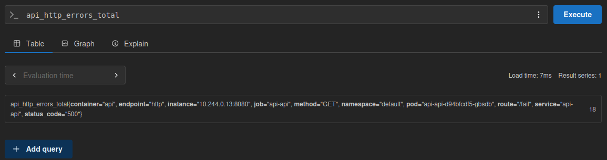

### Панели RED и фактические запросы

В Grafana собрал RED-дашборд с источником `Prometheus`. Запросы каждой панели оставил рядом со скриншотами редактора.

**Rate - количество запросов в секунду**

```promql
sum(rate(api_http_requests_total[1m]))
```

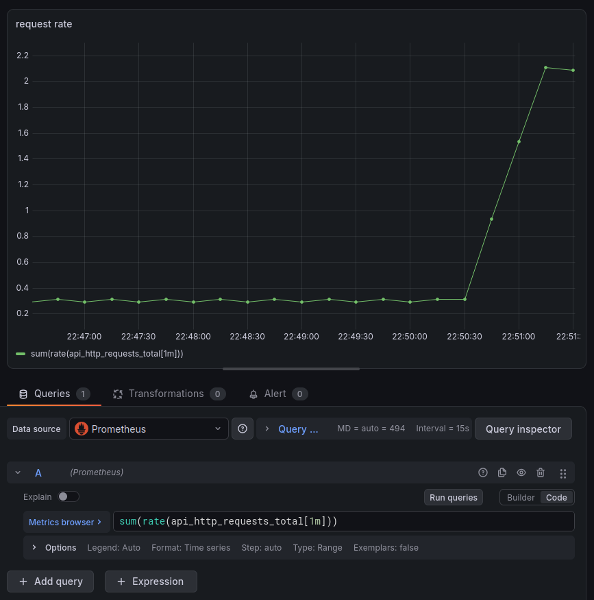

*Интенсивность выросла с фоновых примерно 0,3 до 2,1 запроса в секунду.*

С RPS сначала ошибся. Выбрал `api_http_errors_total`, и панель считала только ошибки. Заменил его на `api_http_requests_total` - теперь учитываются все запросы.

`/metrics` исключён из RED-метрик кодом приложения, а `/health`, включая readiness- и liveness-пробы, учитывается и создаёт фоновый RPS. Поэтому небольшая нагрузка без ручных запросов здесь ожидаема.

**Errors - доля ответов с кодом 5xx в процентах**

```promql
100 * sum(rate(api_http_errors_total[1m]))
/
clamp_min(sum(rate(api_http_requests_total[1m])), 0.001)
```

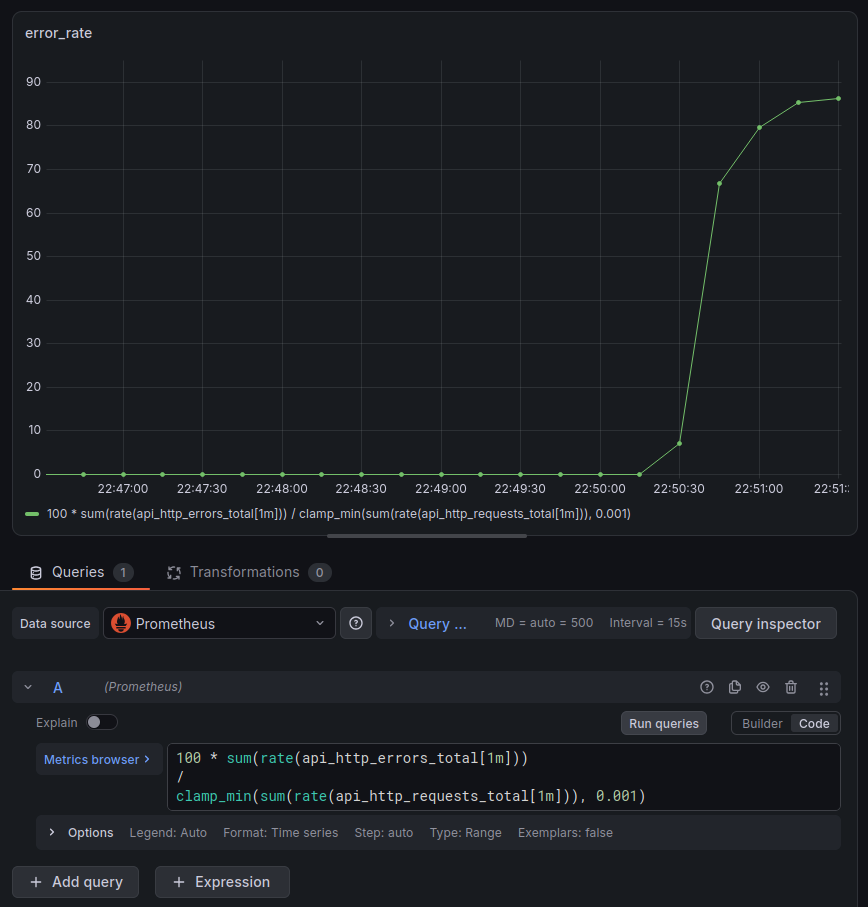

*Во время генерации ошибок доля 5xx выросла примерно до 86%.*

`rate` вычисляет скорость роста счётчиков по окну 1 минута, а их отношение показывает долю ошибок. `clamp_min` ограничивает знаменатель снизу для существующего ряда. Запросы панелей агрегируют все доступные серии метрик без фильтра по namespace; правила алертинга ограничены `namespace="app"`.

**Duration - 95-й перцентиль времени ответа в секундах**

```promql
histogram_quantile(
  0.95,
  sum by (le) (rate(api_http_request_duration_seconds_bucket[1m]))
)
```

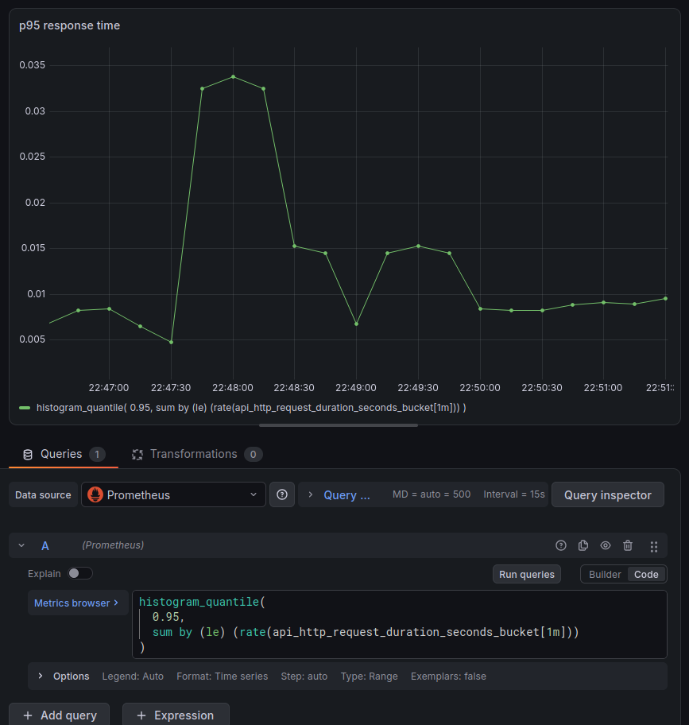

*Панель вычисляет p95 по бакетам гистограммы; на этом отдельном снимке показан интервал преимущественно быстрых запросов.*

`sum by (le)` объединяет бакеты с одинаковой границей, а `histogram_quantile` оценивает p95. Панель учитывает все маршруты; правило высокого p95 ниже исключает `/health` и `/load` и использует окно 2 минуты.

### Нагрузочные проверки и общий дашборд

Готовые панели проверил нагрузкой через `/load`.

```bash
curl "http://127.0.0.1:8080/load?requests=200&concurrency=20"
```

Этот вызов генерирует 200 обращений к `/health` с параллелизмом до 20. Циклы для проверки ошибок и задержек приведены в разделе алертинга.

Здесь уже итоговый дашборд с панелью логов, которую добавил после установки Loki. Временной диапазон у всех панелей общий.

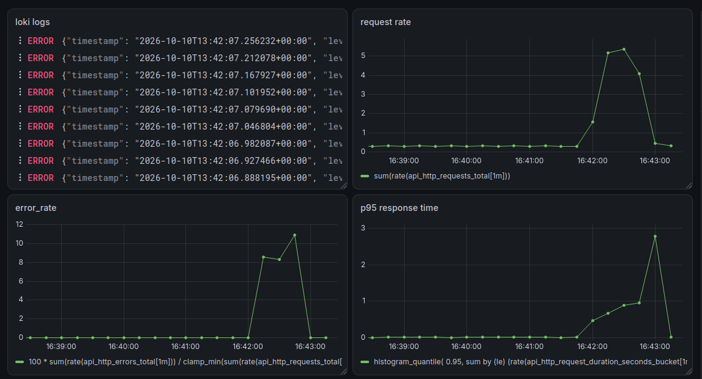

*На одном экране представлены логи Loki, RPS, доля ошибок и p95 в общем временном диапазоне.*

Общий снимок подтверждает рост RPS примерно до 5,3 запроса в секунду, доли ошибок примерно до 11% и p95 примерно до 2,8 секунды, одновременно с появлением error-логов. Эти значения относятся к одному показанному эксперименту; примерно 86% на отдельной панели ошибок получено в другом интервале.

## Часть 2. Централизованное логирование - Loki + Grafana Alloy

### Хранилище и установка компонентов

После вызовов `/fail` на графике росла доля 5xx. Теперь нужно было найти сами записи ошибок. Для отдельного пода хватило бы `kubectl logs`, но я хотел искать логи по меткам и видеть их рядом с графиками в Grafana. Для этого поставил Loki и Alloy.

Loki хранит логи, а Alloy обнаруживает поды, читает контейнерные файлы на нодах и отправляет записи в Loki. Само хранилище не заменяет агент сбора. [loki-values.yaml](../../observability/loki-values.yaml) задаёт `deploymentMode: Monolithic`, одну реплику в секции `singleBinary`, `replication_factor: 1`, filesystem-хранилище и схему TSDB v13. Persistence, gateway и кэши отключены; отдельное отключение Loki Canary в текущем файле не задано. Без persistence сохранность данных после пересоздания пода не гарантируется.

И вот тут ВМ перестала справляться. После добавления Loki она сильно тормозила, обновить релиз через Helm не получалось. Ресурсов на весь стек не хватало.

Увеличил ресурсы ВМ, затем ограничил Minikube и компоненты внутри кластера. Параметры запуска Minikube приведены в части 0. В values-файлах приложения, Prometheus, Grafana, оператора, Alertmanager, Loki, Alloy, Jaeger и webhook заданы requests и limits; у Karma - requests и лимит памяти. Для основного контейнера Loki оставил requests `50m` CPU / `256Mi` памяти и limits `500m` / `768Mi`. После этих изменений смог продолжить работу с Helm.

```bash
helm repo add grafana https://grafana.github.io/helm-charts
helm repo add grafana-community https://grafana-community.github.io/helm-charts
helm repo update
helm upgrade --install loki grafana-community/loki \
  -n observability --create-namespace -f observability/loki-values.yaml
helm upgrade --install alloy grafana/alloy \
  -n observability -f observability/alloy-values.yaml
```

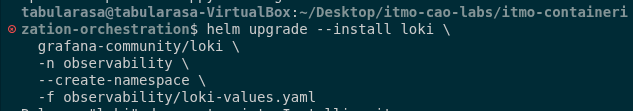

*запуск установки Loki с values-файлом проекта; итоговый статус релиза в кадр не попал.*

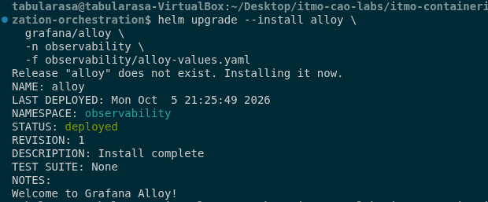

*Alloy установлен как релиз `alloy`, namespace `observability`, Helm-статус `deployed`.*

Затем проверил, появились ли записи приложения в Grafana.

### Обнаружение подов и передача логов

Дальше настроил путь от файла контейнера до Loki. В [alloy-values.yaml](../../observability/alloy-values.yaml) выбрал DaemonSet и монтирование `/var/log`: агенту нужны файлы именно той ноды, на которой он работает. Через Downward API передаётся `NODE_NAME=spec.nodeName`; `discovery.kubernetes` получает метаданные подов через Kubernetes API и фильтрует их по ноде текущего агента.

```alloy
discovery.kubernetes "pods" {
  role = "pod"
  selectors {
    role  = "pod"
    field = "spec.nodeName=" + sys.env("NODE_NAME")
  }
}
```

`discovery.relabel` переносит Kubernetes-метаданные в метки `namespace`, `pod`, `container`, `app`, `node` и `container_runtime`. UID пода и имя контейнера используются для построения `__path__` вида `/var/log/pods/*$1/*.log`. Добавленный `local.file_match` раскрывает файловую маску и передаёт конкретные пути в `loki.source.file`. Затем `stage.cri {}` удаляет обёртку CRI, а `loki.write` отправляет записи на.

```text
http://loki.observability.svc.cluster.local:3100/loki/api/v1/push
```

В обновлённой конфигурации добавлены статические метки `cluster="minikube"`, `environment="lab"`. Для потока `{namespace="app", app="api"}` выполняется `stage.json`: разбираются поля приложения, `stage.timestamp` использует время JSON-записи, а `stage.labels` выносит `level` в индексную метку. `trace_id`, `span_id`, метод, путь, статус и длительность сохраняются через `stage.structured_metadata`; уникальный trace ID не создаёт отдельный индексный поток. Loki разрешает structured metadata через `allow_structured_metadata: true`. На скриншоте контекста ошибки видны метки приложения, ноды, runtime `containerd` и потока `stderr`.

### Grafana Explore и структура записей

В текущем [metrics-values.yaml](../../observability/metrics-values.yaml) для Grafana настроен datasource.

```yaml
additionalDataSources:
  - name: Loki
    type: loki
    uid: loki
    access: proxy
    url: http://loki.observability.svc.cluster.local:3100
```

Grafana обращается непосредственно к Loki на порту 3100, поскольку gateway отключён. Получение записей из datasource Loki подтверждено скриншотом панели ниже.

| Поле JSON-лога | Содержание по коду |
|---|---|
| `timestamp`, `level`, `logger`, `message` | Время UTC, уровень в нижнем регистре, логгер и сообщение |
| `trace_id`, `span_id` | Идентификаторы активной трассировки и спана; вне валидного контекста - нули |
| `method`, `path`, `route`, `status_code`, `duration_ms` | Дополнительные поля записи `request_completed` |
| `exception` | Текст исключения при записи с `exc_info` |

Для `/fail` код формирует error-запись `intentional_failure`, затем информационную запись завершения с HTTP 500. Hook инструментации сохраняет trace ID в ASGI scope, чтобы запись завершения могла использовать ID входящего запроса.

Для проверки снова вызвал `/fail`, затем нашёл ошибки в Grafana через источник данных Loki. Здесь пригодились метки namespace, приложения и уровня: вместо всего вывода контейнера можно выбрать только нужные записи. На снимке панели использован LogQL-запрос.

```logql
{namespace="app", app="api", level="error"}
```

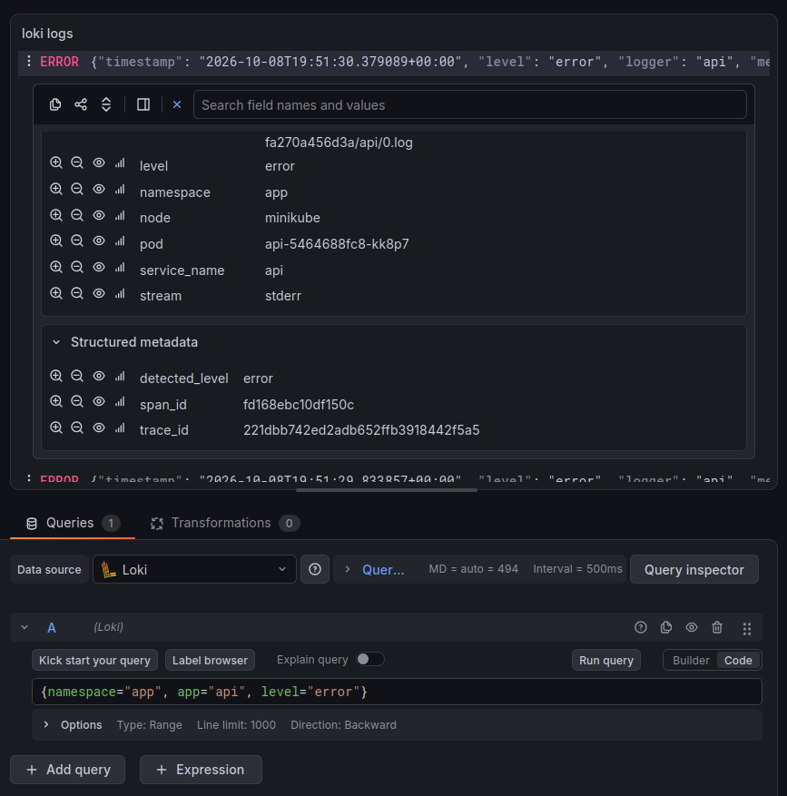

*Grafana получила error-записи приложения; в раскрытой строке видны `namespace=app`, поток `stderr`, `trace_id` и `span_id` в structured metadata.*

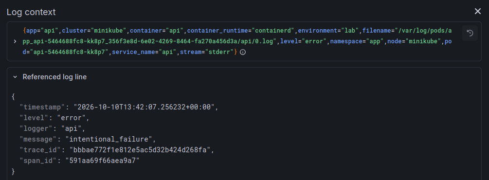

*В контексте записи показаны `message="intentional_failure"`, `level="error"`, метки Alloy и ненулевой trace ID.*

Фактическая запись из этого снимка.

```json
{
  "timestamp": "2026-10-10T13:42:07.256232+00:00",
  "level": "error",
  "logger": "api",
  "message": "intentional_failure",
  "trace_id": "bbbae772f1e812e5ac5d32b424d268fa",
  "span_id": "591aa69f66aea9a7"
}
```

По этим записям проверил всю цепочку: JSON в stderr контейнера → файл на ноде → Alloy → Loki → Grafana. Вместе с сообщением об ошибке сохранился `trace_id`. Он пригодится на следующем шаге: позволит искать трассировку конкретного запроса в Jaeger, а не подбирать её только по времени.

## Часть 3. Распределённая трассировка - OpenTelemetry

### Инструментирование и экспорт

Для `/slow` одного сообщения в логе мало. Ответ задерживается на 1–3 секунды, и нужно увидеть, какая операция занимает это время. Добавил спаны через OpenTelemetry и отправил их в Jaeger.

В [исходном коде](../../api/main.py) создаётся `TracerProvider` с ресурсом `service.name=api`; `BatchSpanProcessor` отправляет спаны через `OTLPSpanExporter` из пакета `opentelemetry.exporter.otlp.proto.grpc`. `FastAPIInstrumentor` создаёт серверный спан входящего HTTP-запроса, а `HTTPXClientInstrumentor` инструментирует внутренние обращения `/load` и распространяет trace context.

Чтобы в трассировке было видно причину задержки, для `/slow` отдельно выделил медленную операцию.

```python
delay = random.uniform(1.0, 3.0)
with tracer.start_as_current_span("slow-op") as span:
    span.set_attribute("slow.duration_seconds", delay)
    time.sleep(delay)
```

В водопаде ниже серверный спан содержит дочерний `slow-op`, длительность которого определяется задержкой. Для `/fail` текущий спан получает `StatusCode.ERROR` с описанием `intentional failure` и атрибутом `error.type=intentional_failure`; обработчик возвращает HTTP 500.

Адрес Jaeger и параметры экспорта указал в [values приложения](../../helm/api/values.yaml).

```yaml
- name: OTEL_SERVICE_NAME
  value: api
- name: OTEL_EXPORTER_OTLP_ENDPOINT
  value: http://jaeger.observability.svc.cluster.local:4317
- name: OTEL_EXPORTER_OTLP_PROTOCOL
  value: grpc
```

Протокол экспорта фактически определяется также импортированным gRPC-экспортёром: замена одной переменной `OTEL_EXPORTER_OTLP_PROTOCOL` не переключит этот код на HTTP. `http://` в endpoint используется для выбора `insecure=True`; это OTLP/gRPC без TLS на порту 4317, а не OTLP/HTTP на 4318. Отдельный OpenTelemetry Collector в проекте не описан - приложение отправляет спаны непосредственно в Jaeger.

После настройки экспорта вызвал `/slow` и `/fail`, затем проверил их трассировки в Jaeger.

### Jaeger и проверка трассировок

В [jaeger-values.yaml](../../observability/jaeger-values.yaml) задана одна реплика и ограничения ресурсов: requests `50m` / `128Mi`, limits `500m` / `512Mi`. Файл не задаёт хранилище, OTLP receiver или порты явно; соответствующие параметры зависят от версии внешнего чарта, которая в проекте не закреплена. Поэтому режим хранения и фактическое открытие порта 4317 нельзя подтвердить только этим файлом.

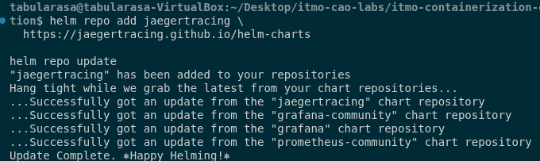

*добавлен репозиторий `jaegertracing` и обновлены индексы Helm; установка Jaeger и наличие трассировок этим снимком не подтверждаются.*

```bash
helm upgrade --install jaeger jaegertracing/jaeger \
  -n observability -f observability/jaeger-values.yaml --wait --timeout 10m
kubectl get svc -n observability jaeger
kubectl exec -n app deployment/api -- printenv | grep OTEL
curl http://127.0.0.1:8080/slow
curl http://127.0.0.1:8080/fail
kubectl port-forward -n observability svc/jaeger 16686:16686
```

Открыл Jaeger на локальном порту 16686 и нашёл трассировки сервиса `api`.

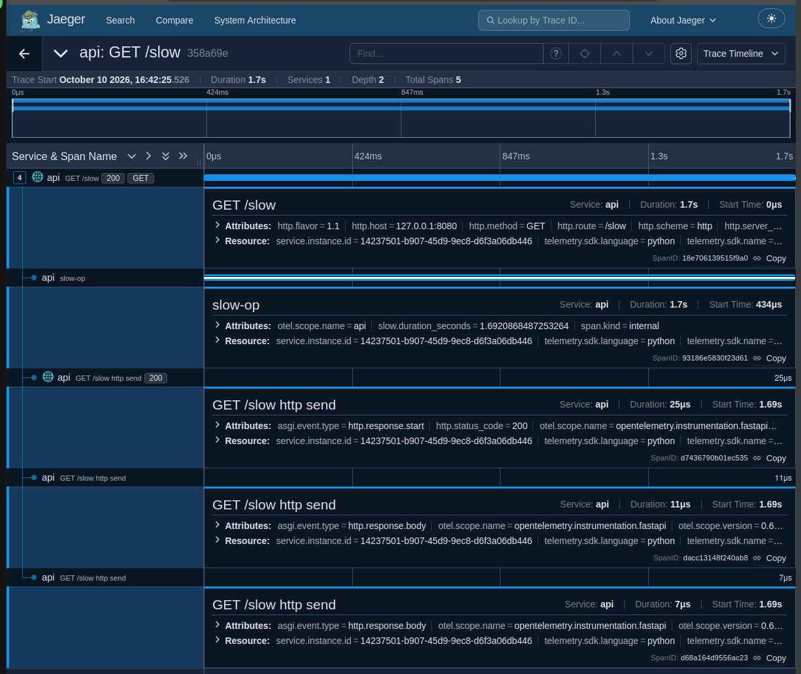

*Трейс `GET /slow` длится около 1,7 секунды и содержит 5 спанов. Дочерний `slow-op` занимает почти всё время запроса; `slow.duration_seconds` равен примерно 1,692.*

Служебные ASGI-спаны занимают микросекунды. Почти все 1,7 секунды этого запроса ушли на `slow-op`.

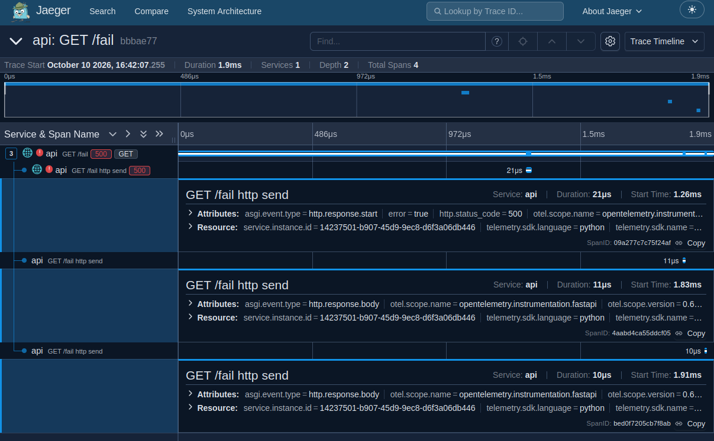

*Трейс `GET /fail` длится около 1,9 мс, содержит 4 спана; HTTP 500 и ошибки отмечены красным. В раскрытом спане видны `error=true` и `http.status_code=500`.*

Снимок подтверждает ошибочную трассировку; атрибут `error.type=intentional_failure` задан обработчиком в коде, но на этом изображении не раскрыт.

### Корреляция логов и трейсов

После отдельных проверок логов и трейсов сопоставил один запрос между ними. Из контекста error-лога взял `trace_id=bbbae772f1e812e5ac5d32b424d268fa`. На снимке Jaeger заголовок трассировки `/fail` содержит соответствующий префикс `bbbae77`; начало запроса - 10 октября в `16:42:07.255`, а запись лога - `13:42:07.256232+00:00`. С учётом отображения времени UTC+3 эти моменты совпадают с точностью до миллисекунд. Лог и трейс показывают ошибку HTTP 500; в заголовке Jaeger идентификатор отображается в сокращённом виде.

Datasource Jaeger и `derivedFields` у Loki в конфигурации Grafana не заданы. Для поиска трассировки вручную копирую trace ID из лога в поле Lookup by Trace ID в Jaeger.

## Часть 4. Алертинг - Prometheus + Alertmanager + Karma

### Правила PrometheusRule

Постоянно держать Grafana перед глазами неудобно. Настроил алерты для тех же сбоев, которые уже проверял вручную. В [prometheusrule.yaml](../../helm/api/templates/prometheusrule.yaml) добавил три правила в группу `api.rules`, объект `api-alerts`. У всех заданы `severity: critical`, `service: api` и `for: 1m`. В аннотациях есть описание проблемы и runbook с действиями для диагностики.

| Алерт | Условие | Назначение порога и действия |
|---|---|---|
| `ApiHighErrorRate` | Доля 5xx выше 20% по окну 1 минута, условие держится 1 минуту | Значительная часть запросов не выполняется; проверить RED, маршрут ошибок, Loki и связанный trace |
| `ApiHighLatencyP95` | p95 выше 1,5 секунды по окну 2 минуты, условие держится 1 минуту | Существенная задержка ответов; проверить медленный маршрут и длительные спаны |
| `ApiDown` | Нет ни одного доступного target выбранного API либо ряды `up` отсутствуют, в течение 1 минуты | Потеря сбора метрик API; проверить поды, Service, endpoints, события и логи |

Для учебной проверки выбрал пороги, которые можно воспроизвести обработчиками сервиса: 20% выделяет выраженную деградацию по ошибкам, а 1,5 секунды позволяет обнаруживать задержки от `/slow`. Производственный SLO этими значениями не задавал. `for: 1m` отсекает кратковременное превышение. При проверке нужно учитывать, что время до `firing` зависит также от наполнения окна `rate` и evaluation interval и не равно строго сумме окна и `for`.

В шаблоне используются следующие выражения PromQL.

```promql
(
  sum(rate(api_http_errors_total{namespace="app"}[1m]))
  /
  clamp_min(sum(rate(api_http_requests_total{namespace="app"}[1m])), 0.001)
) > 0.20
```

```promql
histogram_quantile(
  0.95,
  sum by (le) (
    rate(api_http_request_duration_seconds_bucket{
      namespace="app", route!="/health", route!="/load"
    }[2m])
  )
) > 1.5
```

```promql
(max(up{namespace="app", service=~"api|api-api"}) == 0)
or
absent(up{namespace="app", service=~"api|api-api"})
```

В latency-правиле исключены `/health` и `/load`, чтобы пробы и генератор нагрузки не определяли p95 прикладных операций. `ApiDown` использует `max`: при нескольких целях одного Service достаточно хотя бы одной доступной; отдельная потеря реплики не вызовет этот алерт. `absent` покрывает исчезновение target целиком. Недоступность `/metrics` не обязательно означает недоступность всех HTTP-эндпоинтов, поэтому алерт следует трактовать как потерю доступного target для Prometheus.

В шаблоне namespace, пороги и правила заданы жёстко. Значения `alerts.enabled`, `alerts.errorRateThreshold` и `alerts.latencyP95Seconds` из `values.yaml` сейчас не используются этим шаблоном: изменение values не переключает и не перенастраивает эти правила. Запросы ошибок и задержки ограничены namespace `app`, но не конкретным Service.

### Alertmanager и webhook-получатель

Alertmanager включён в текущем [metrics-values.yaml](../../observability/metrics-values.yaml). Он группирует алерты по `alertname` и `service`; `group_wait: 10s`, `group_interval: 30s`, `repeat_interval: 5m`. Маршрут по умолчанию использует получателя `null`; `Watchdog` и `InfoInhibitor` также направляются в `null`, а `severity="critical"` - в `webhook`.

```yaml
- name: webhook
  webhook_configs:
    - url: http://alert-webhook.observability.svc.cluster.local:8080/alerts
      send_resolved: true
```

Получатель реализован в [alert-webhook/server.py](../../alert-webhook/server.py), контейнер - в [Dockerfile](../../alert-webhook/Dockerfile), Deployment и Service - в [Helm-чарте webhook](../../helm/alert-webhook). Сервер принимает `POST /alerts`, разбирает JSON, пишет событие `alertmanager_webhook` и отдельную запись `alert` для каждого алерта, затем отвечает HTTP 200. Отдельный `GET /health` используется для Kubernetes-проб. Образ запускается от пользователя с UID 10001.

```bash
minikube image build -t alert-webhook:latest ./alert-webhook
```

Получатель запустил в namespace `observability`, логи смотрел у `deployment/alert-webhook`. При доработке чарта перенёс [helper-файл](../../helm/alert-webhook/templates/_helpers.tpl) в `templates/`. Он определяет `alert-webhook.fullname`, который используется в Deployment и Service.

Проверил каждое правило отдельно, намеренно вызывая нужный сбой.

### Проверка высокой доли ошибок

Для устойчивого превышения порога отправил 180 запросов к `/fail` с паузой 0,5 секунды.

```bash
for i in {1..180}; do
  curl -s -o /dev/null http://localhost:8080/fail
  sleep 0.5
done
```

После устойчивого превышения порога правило `ApiHighErrorRate` перешло в `firing`. На снимке доля ошибок равна примерно 0,8617 (86,17%), что превышает порог 0,2.

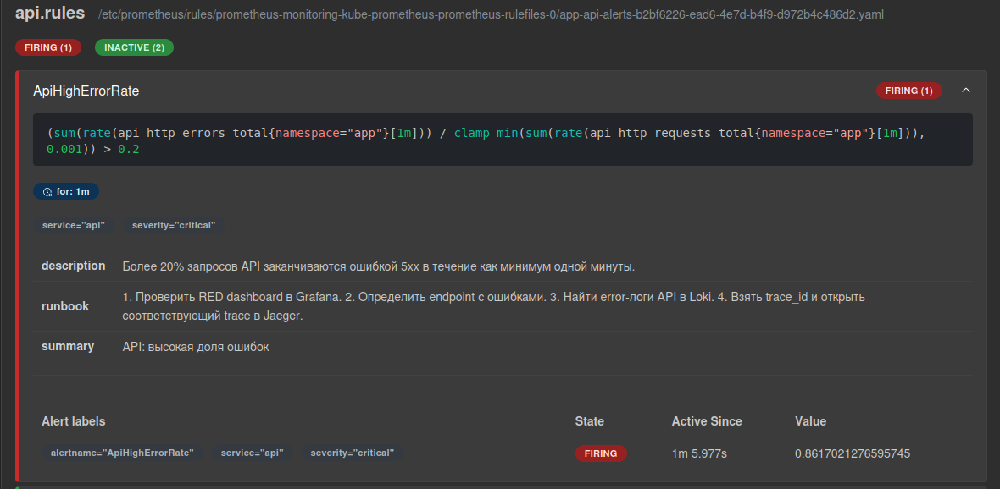

*Prometheus показывает `ApiHighErrorRate` в `FIRING`, `for: 1m` и метки `service=api`, `severity=critical`.*

### Проверка высокого p95

В течение 90 секунд запускал по одному запросу `/slow` в секунду. Запросы выполняются в фоне, поэтому медленные операции перекрываются.

```bash
end=$((SECONDS+90))
while [ $SECONDS -lt $end ]; do
  curl -s http://localhost:8080/slow >/dev/null &
  sleep 1
done
wait
```

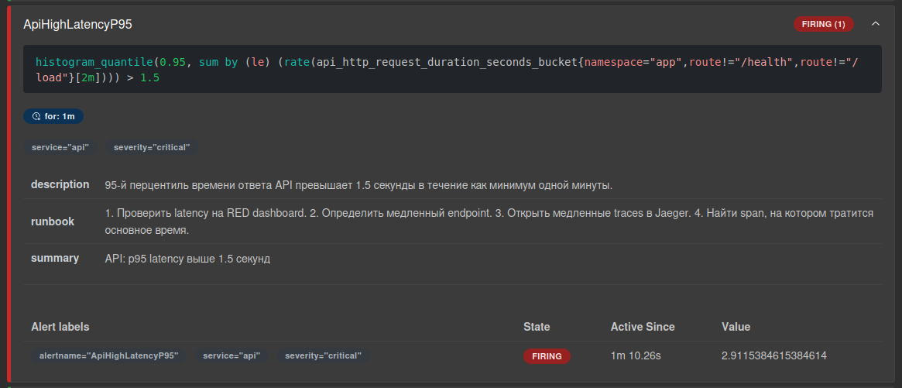

*Правило `ApiHighLatencyP95` перешло в `FIRING`: рассчитанный p95 равен примерно 2,9115 секунды при пороге 1,5 секунды.*

### Проверка недоступности API

Последний сценарий - полное исчезновение target. Для этого масштабировал Deployment приложения до нуля реплик.

```bash
kubectl scale deployment/api -n app --replicas=0
```

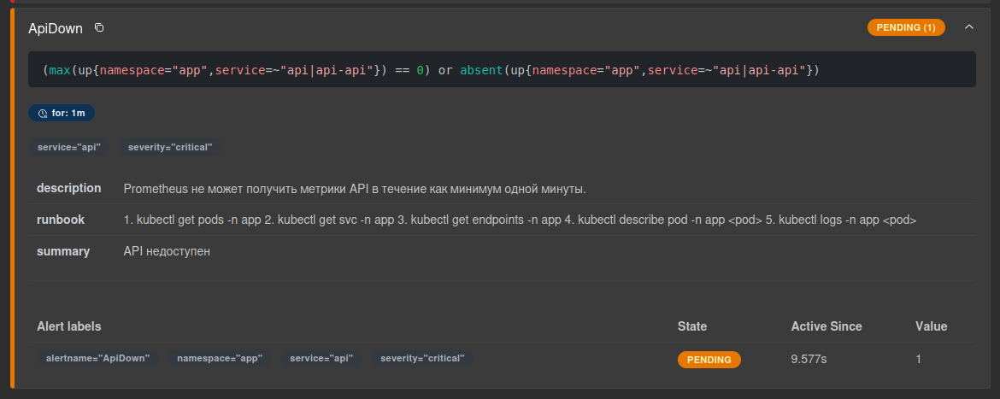

*Сначала `ApiDown` находится в `PENDING`: условие уже истинно, но выдержка `for: 1m` ещё не завершилась.*

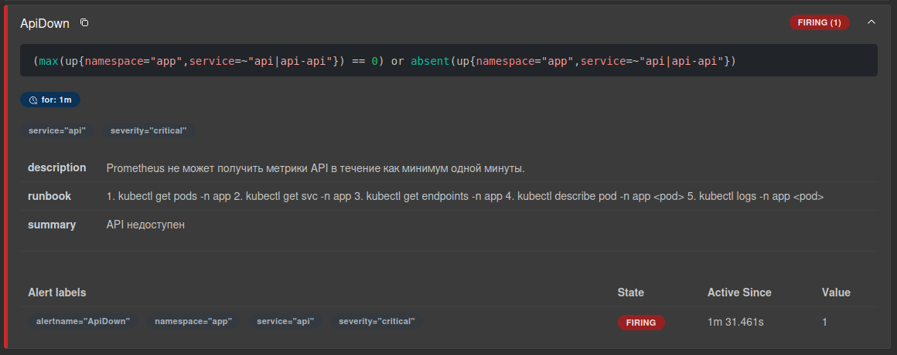

*При сохранении недоступности алерт перешёл в `FIRING`; на снимке видны `namespace=app`, `service=api` и значение 1.*

После срабатывания правил проверил, дошли ли уведомления до webhook.

### Доставка уведомлений и восстановление

Уведомления проверял в логах получателя.

```bash
kubectl logs -n observability deployment/alert-webhook -f
```

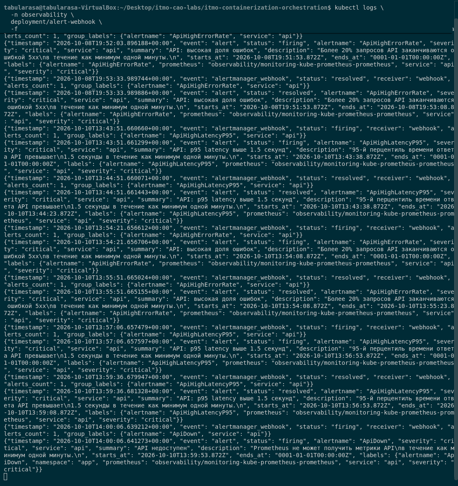

*Получатель записал `firing` для `ApiHighErrorRate`, `ApiHighLatencyP95` и `ApiDown`. Для ошибок и высокого p95 также видны уведомления `resolved`.*

В логах получателя видны `event="alertmanager_webhook"`, `receiver="webhook"`, `alerts_count=1` и отдельные события `alert` с именем правила и `severity="critical"`. Это подтверждает доставку от Alertmanager до получателя для всех трёх сценариев. `send_resolved: true` проверен по уведомлениям восстановления ошибок и задержки.

### Karma

В [karma-values.yaml](../../observability/karma-values.yaml) указал адрес Alertmanager.

```text
http://monitoring-kube-prometheus-alertmanager.observability.svc.cluster.local:9093
```

Чтобы просматривать активные алерты в отдельном интерфейсе, добавил Karma. Karma получает активные алерты через API Alertmanager и предоставляет фильтры и группировку. Правила по-прежнему вычисляет Prometheus, доставку выполняет Alertmanager.

```bash
helm upgrade --install karma wiremind/karma \
  -n observability -f observability/karma-values.yaml --wait
kubectl port-forward -n observability svc/karma 8081:80
```

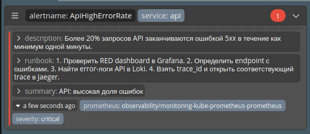

*Карточка `ApiHighErrorRate` с уровнем critical и инструкцией диагностики.*

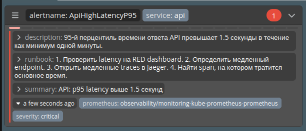

*Карточка `ApiHighLatencyP95` с описанием превышения 1,5 секунды.*

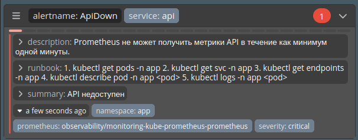

*Карточка `ApiDown` с namespace `app` и runbook проверки подов и Service.*
